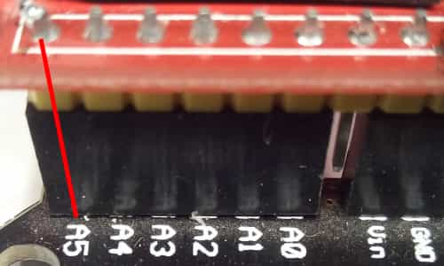
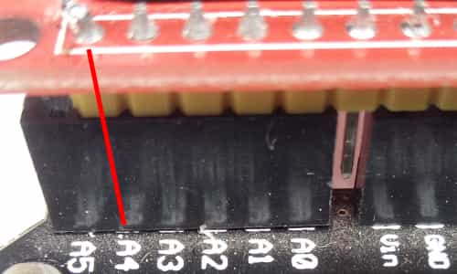

## Драйвера дисплеев

Для подключения необходимо в файле config.h выбрать необходимые опции.
Желательно скопировать config.h в свою директорию, что позволит иметь конфигурацию для каждой сборки.

### Цветовая модель

|Тип|Структура|Байт в памяти|
|:---:|:---:|:---:|
| RGB12 | 4x4x4 | 2 |
| RGB16 | 5x6x5 | 2 |
| RGB18 | 6x6x6 | 3 |

### Повороты дисплея

|  Угол  |   FLIP_X  |   FLIP_Y  |   EX_X_Y  |
|:---:|:---:|:---:|:---:|
|   0°   |     -     |     -     |     -     |
|  90°   |     -     |     +     |     +     |
| 180°   |     +     |     +     |     -     |
| 270°   |     +     |     -     |     +     |

### Варианты подключения

Выбрать нужную пред-установку:

<details>
   <summary>PRESET_ST7735_A5</summary></br>
   
</details>
<details>
   <summary>PRESET_ST7735_A4</summary></br>
   
</details></br>

Либо назначить выводы самостоятельно:

Пример:

```c++
#define L_RES(x) x(C, PC4)
#define L_CS(x) x(C, PC5)
```

Используемые пины можно посмотреть в файле pins.h соответствущего драйвера.

### Драйвер дисплея

Подключать заголовочные файлы только после всех установок.

| Драйвер | Путь |
|:---:|:---:|
| ST7735_SOFT | ST7735_SOFT/driver.h |
| ST7735_SPI  | ST7735_SPI/driver.h  |

### Класс дисплея

После всех установок подключить display.h

Можно создавать объекты дисплеев, либо индивидуально (если подключено несколько дисплеев или есть необходимость в использовании нескольких цветовых режимов), либо один на основании предыдущих установок:

```с++
  CDisplay < ST7735_SPI<RGB18>, RGB18> lcd18;
  CDisplay < ST7735_SPI<RGB16>, RGB16> lcd16;

  lcd16.init();
  // тут можно использовать 65k цветов
  lcd18.init();
  // теперь можно использовать 262к цветов

  Display lcd; // либо так, без возможности переключаться
```
