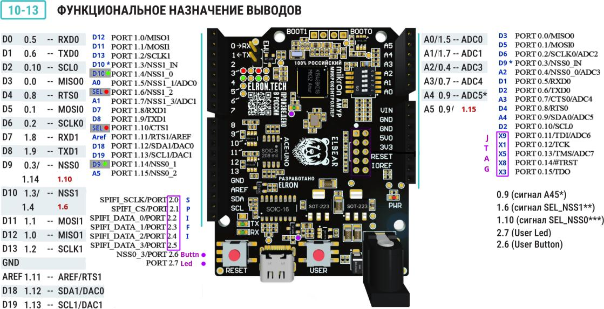

# 

## Кроссплатформенное использование ATmega и MIK32 AMUR

### Поддерживаемые MK / Платы

+ **ATmega328P / Uno R3 - 16...27 МГц**
+ **MIK32 AMUR / ACE UNO**

### Поддерживаемые дисплеи

+ **ST7735**
  + Программно
  + SPI
+ **ST7789**
  + 8 bit
+ **ILI9486**
  + 8 bit
  + 16 bit

### Используемые библиотеки

+ **arduino-avr** только "Arduino.h"
+ **mik32v2-sdk** только заголовки

### Используемые инструменты

+ PlatformIO - <https://platformio.org>
+ VSCode - <https://code.visualstudio.com>
+ Arduino IDE [Скрипт для установки платы Elbear](https://elron.tech/files/package_elbear_beta_index.json)
+ Загрузчик [elbear uploader](https://gitflic.ru/project/elron-tech/elbear_uploader)
