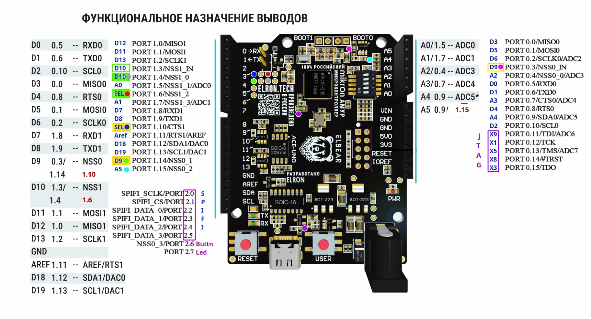

# Песочница для ATmega и MIK32 AMUR

## 

### MK / Платы

+ **ATmega328P / Uno R3 - 16...27 МГц**
+ **MIK32 AMUR / ACE UNO**

### Дисплеи

+ **ST7735**
  + Программно
  + SPI
+ **ILI9225**
  + Программно
  + SPI
+ **ST7789**
  + 8 bit
+ **ILI9486**
  + 8 bit
  + 16 bit
+ **NT35510**
  + 16 bit

### Используемые библиотеки

+ **mik32v2-sdk** <https://gitflic.ru/project/mikron-mik32/mik32v2-shared>
+ **libfixmath** <https://github.com/PetteriAimonen/libfixmath>
+ **arduino** <https://gitflic.ru/project/elron-tech/elbear_arduino_bsp>

### Используемые инструменты

+ PlatformIO - <https://platformio.org>
+ VSCode - <https://code.visualstudio.com>
+ Загрузчик [elbear uploader](https://gitflic.ru/project/elron-tech/elbear_uploader)

### PlatformIO

Репозитории для развёртывание <https://gitflic.ru/company/mikron-mik32>

### Предупреждение

Репозиторий служит исключительно для экскрементов, не имеет стабильной структуры и содержимого.
